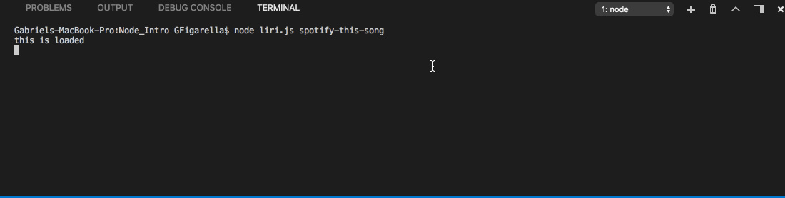

# Node_Intro / LIRI Homework

In this assigment, I will make an interpretation program akin to SIRI, but instead of voice-interpretation, it will be 'language'-interpretation. For this assignment, I will be using the Twitter, Spotify and OMDB APIs.

The user will enter some specific commands in the command line, and depending on the command entered, a different API will run.

### Using LIRI 

The user will input specific commands to run LIRI bot in the command line. Some of the commands will require more than one input:
  * spotify-this-song <song name> : 
     * will return the song name, artist, album and preview link of the song provided by the user.
 
  * movie-this <movie name>:
     * will return title, year of release, actors, language, ratings, country of production and the plot of the movie provided by the user.
 
  * my-tweets:
     * will return the latst 20 tweets of the user.
     
  * do-what-it-says
     * will return a predefined command.
  
For movie-this and spotify-this-song, if no song is provided by the user, LIRI will search Mr.Nobody and The Sign by default, respectively.

### Project showcase:

